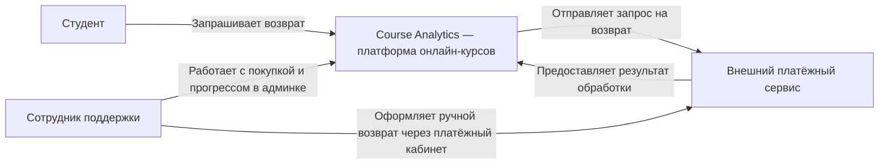

# Модуль 1. Границы системы и архитектурный контекст

Чтобы реализовать фичу, нужно понимать две вещи: **какую задачу она решает и где заканчивается наша ответственность**. Иначе в разработку незаметно попадут новые требования, чужие обязанности и неподтверждённые ограничения.

Во [вводной лекции](00-analysis-intro.md) ты учился находить неизвестное и выбирать источник ответа. Теперь применим этот подход к контексту задачи, участникам, ограничениям и границам системы.

После модуля у тебя будут описание контекста, карта участников, требования с источниками и диаграмма взаимодействий. Эти материалы станут частью будущей спецификации.

## 1. Жизненный цикл идеи: от проблемы к тикету

Epic → Story → Task помогают разложить работу. Но из названия тикета не всегда понятно, зачем она нужна и какие решения уже приняты.

Обычно путь от идеи к реализации включает:

1. **Формулирование проблемы (Problem Framing).** У кого возникает затруднение и в какой ситуации?
2. **Исследование (Discovery).** Что известно из обращений, данных и наблюдений? Какие объяснения пока остаются гипотезами?
3. **Определение объёма (Scope).** Какое изменение согласовано для этого релиза? Какие случаи остаются за его пределами?
4. **Проектирование (System Design).** Как будут устроены поведение, данные и взаимодействия?
5. **Проверка (Validation).** Соответствует ли решение правилам, ограничениям и примерам заказчика?
6. **Поставка (Delivery).** Реализация, инженерные проверки и приёмка заказчиком.

Это ориентиры, а не обязательная последовательность отдельных фаз. Исследование кода может изменить границы задачи, а прототип — обнаружить недостающее правило. Тикеты можно заводить и для такой исследовательской работы.

В этом курсе продуктовую фичу выбирает продакт-менеджер. Тебе нужно восстановить контекст её реализации. Если выяснится, что цель и требования конфликтуют, покажи последствия и верни решение продакту.

Например, «внедрить геймификацию» описывает решение. «Студенту трудно понять, насколько он продвинулся» описывает возможную проблему. Связь между ними требует подтверждения: нельзя считать, что ачивки автоматически решат её.

### Продолжаем кейс возвратов

Используй материалы S1–S6 из вводной лекции. Все сведения кейса вымышлены и созданы для обучения.

Из них уже известно:

- цель продакта — сократить ручную работу поддержки;
- первый релиз охватывает полный возврат по покупке отдельного курса;
- частичные возвраты, пакеты и исключения выше порога остаются в ручной процедуре;
- запрос на выплату и подтверждение выплаты — разные события;
- формула прогресса для проверки права на возврат ещё не согласована.

**Белое пятно:** какую часть ручной работы должна убрать фича? Если стандартные заявки автоматизируются, а спорные передаются поддержке, важно выяснить границу этих случаев.

**Вопрос заказчику:** «Какие шаги поддержки должны исчезнуть для стандартной заявки? Что сотрудник продолжает делать при исключении?»

**Задача для ИИ:** сопоставить S1–S6 и предложить неоднозначные границы первого релиза. Каждый вывод должен ссылаться на материал либо быть помечен как гипотеза.

### Миниквиз 1. Решение или контекст?

Разработчик предлагает добавить автоматические частичные возвраты: «Иначе цель сокращения ручного труда выполнится не полностью». Как поступить?

- А. Добавить их в первый релиз, потому что это соответствует общей цели.
- Б. Сохранить согласованный объём, а расширение представить продакту как предложение с последствиями.
- В. Перестать обсуждать цель: она не касается реализации.

Разбор

Б. S4 оставляет частичные возвраты в ручной процедуре. Общая цель помогает понимать решения, но не разрешает самостоятельно расширять объём. Предложение можно обсудить, указав дополнительную сложность и влияние на сроки.

## 2. Как добывать сведения и проверять объяснения

### «5 почему»: выяснить смысл запроса

Метод предлагает последовательно уточнять, почему возникло требование. Число пять — ориентир; важнее добраться до объяснения, которое влияет на решение.

Заказчик просит экспорт в Excel. Можно спросить: «Какую работу вы выполняете после выгрузки?» Если ответ — сверка данных, дальше выясняем её участников, правила и ограничения. Экспорт может остаться подходящим решением, а может оказаться лишним шагом.

Не подставляй ответы за заказчика. Цепочка правдоподобных объяснений от ИИ остаётся набором гипотез. У проблемы может быть несколько причин, а последний ответ не обязательно является корневой причиной.

### Триангуляция: сопоставить разные источники

**Триангуляция** — проверка понимания по нескольким источникам:

- **Интервью:** что участники сообщают о работе и её правилах.
- **Данные и логи:** какие действия зафиксированы; сначала проверь полноту и смысл записей.
- **Наблюдение (Shadowing):** как человек выполняет конкретную задачу на практике.
- **Совместный разбор:** где объяснения разных участников расходятся.

В кейсе S2 описывает практику поддержки, S5 — расчёт в коде, S1 и S4 — намерение и решения продакта. Их нужно сопоставить. Округлённое поле в админке ещё не доказывает, что именно оно должно определять право возврата.

### Минизадание 2. Выбери проверку

Поддержка говорит: «Прогресс в админке иногда выглядит неправильно». Предложи следующий вопрос человеку и исследование системы. Объясни, что каждый шаг позволит выяснить.

Пример разбора

Человеку: «Покажите последний конкретный случай: какое значение ожидали, что увидели и как принимали решение?» Это уточнит смысл слова «неправильно».

В системе: проверить расчёт и обновление прогресса для этого случая, включая округление и снятие отметки завершения. Это позволит отделить дефект расчёта от расхождения ожиданий и правила.

ИИ можно дать найденный код и пример для разбора. Проверяй ссылки на код; целевое правило затем согласуй с продактом.

## 3. Стейкхолдеры: кто знает, кто решает, кого затронет

**Стейкхолдер** — участник, на которого влияет изменение или который влияет на его реализацию. Помимо заказчика и пользователя это могут быть поддержка, финансы, безопасность и владельцы смежных систем.

Разделяй три роли: человек знает текущий процесс; человек согласует правило; человек выполняет или сопровождает решение. Они могут принадлежать разным участникам.

| Участник кейса | Что у него выясняем | Полномочия и пробелы |
|---|---|---|
| Продакт-менеджер | Правила, границы, примеры приёмки | S1 и S4 подтверждают согласование правил и приёмку |
| Поддержка | Ручной процесс, исключения, реальные обращения | Кто разрешает исключения, ещё нужно уточнить |
| Студент | Как понимает статус и что делает при задержке | Не утверждает правила возврата в нашем кейсе |
| Владелец интеграции | Возможности провайдера и обработку статусов | Не устанавливает бизнес-политику возврата |
| Ответственный за финансы | Сверку выплат и ответственность за расхождения | Его участие — пока предложение; роль и требования нужно выяснить |

### Влияние и интерес

Матрица «Влияние / Интерес» помогает выбрать формат взаимодействия:

- Высокое влияние и высокий интерес: вовлекать в обсуждение ключевых решений.
- Высокое влияние и низкий интерес: согласовывать последствия кратко и предметно.
- Низкое влияние и высокий интерес: исследовать работу и проверять удобство сценариев.
- Низкое влияние и низкий интерес: определить, какие изменения человеку нужно сообщить.

Влияние не равно праву утверждать любое требование. Уточняй полномочия для конкретного решения. В нашем кейсе недостаточно сведений, чтобы уверенно расставить всех по матрице.

### Конфликты и компромиссы (Trade-offs)

Поддержка может хотеть сохранить ручные исключения, а продакт — убрать ручное участие. Сначала уточни область каждого требования: возможно, они относятся к разным случаям. Если конфликт остаётся, представь варианты и последствия тому, кто вправе принять решение.

**Вопрос заказчику:** «Какие исключения сохраняем, кто их разрешает и как они соотносятся с автоматическим отказом?»

**Задача для ИИ:** найти в высказываниях участников потенциальные конфликты и предложить вопросы для проверки. Модель не назначает владельца решения без основания.

### Миниквиз 3. Кто утверждает правило?

Поддержка предлагает разрешить возврат до 15% прогресса. В S1 указан порог 10%. Можно ли сразу обновить спецификацию?

Разбор

Предложение нужно записать и выяснить основание. Из материалов известно, что правила согласует продакт. До его решения порог 15% не становится целевым правилом. Возможно, речь идёт о ручном исключении, а не изменении общего порога.

## 4. Нефункциональные требования: ограничения с основаниями

Функциональное требование описывает поведение: например, повторная заявка не приводит к повторной выплате. **Нефункциональные требования (NFR)** описывают характеристики и ограничения работы системы: время ответа, нагрузку, доступность, безопасность.

Они влияют на проектирование, поэтому их нужно выяснять вместе с правилами поведения.

| Направление | Откуда получать сведения | Что уточнять |
|---|---|---|
| Производительность | Нагрузка существующей системы, планы бизнеса | Какое действие измеряем, при какой нагрузке и каким способом? |
| Надёжность | Требования к работе сервиса, последствия сбоев | Какая задержка или недоступность допустима, как восстанавливаемся? |
| Безопасность и обязательные ограничения | Ответственные специалисты, применимые документы | Кто имеет доступ, какие сведения обрабатываем, какие ограничения действуют? |
| Инфраструктура | Текущая платформа, бюджет, команда эксплуатации | Какие технологии и ресурсы доступны, кто их сопровождает? |

Не придумывай числа ради заполнения раздела. Если источник не найден, запись остаётся предложением или вопросом. Даже при наличии источника нужно проверить применимость и согласовать требование.

### Превратить «быстро» в проверяемое требование

В S1 есть «всё работало быстро». S6 сообщает, что принятие заявки, подтверждение возврата и поступление денег разделены. Нужно уточнить ожидания по каждому этапу и пределы контроля платформы.

Рабочая форма требования:

> Для **[операции]** при **[условиях нагрузки]** значение **[метрики]** должно быть **[порог]**. Источник: **[документ или согласование]**. Проверка: **[метод]**.

Пока поля неизвестны, это шаблон для уточнения. Например, «95% ответов о принятии заявки за 2 секунды» — возможная формулировка, **не согласованное требование кейса**.

### Минизадание 4. Проверь NFR от ИИ

ИИ предложил: «Возврат должен завершаться за две секунды; доступность — 99,99%; нужно использовать Kafka». Найди проблемы и составь два уточняющих вопроса.

Разбор

Две секунды и доступность не имеют источников, условий и способов измерения. Завершение выплаты зависит от внешних участников — S6. Kafka — предложенное техническое решение; его необходимость не обоснована.

Вопросы: «Как быстро студент должен получить подтверждение приёма заявки и что увидит при ожидании?»; «Какая недоступность подачи заявки допустима и какова процедура в этом случае?» Затем нужно проверить возможности текущей системы и провайдера.

## 5. Границы фичи и границы системы

Это разные решения.

**Границы фичи** определяют, что меняется в релизе. В S4 полный возврат отдельного курса включён, частичный — оставлен поддержке.

**Границы системы** определяют, что входит в рассматриваемую программную систему и с чем она взаимодействует. Для нашей схемы система — платформа Course Analytics. Платёжный провайдер находится снаружи; механизмы покупки, обучения и поддержки рассматриваем внутри платформы.

Это не предписывает монолит или микросервисы. Граница рассматриваемой системы и границы развёртывания — отдельные вопросы.

### Внешние взаимодействия

Для каждого взаимодействия выясни цель, сведения и ответственность. Например, платформа отправляет запрос провайдеру и получает статус. Способ получения итогового статуса пока открыт: нельзя обозначать вебхук как установленный факт.

**Белое пятно:** кто отвечает за заявку, если окончательный статус неизвестен?

**Вопрос участникам:** «Кто разбирает зависшие заявки и какие сведения ему доступны?»

**Задача для ИИ:** проверить, для каких взаимодействий на схеме отсутствуют описания ответственности и поведения при сбое.

### Внутренние границы: DDD и Event Storming

**DDD (Domain-Driven Design)** помогает разделять модели по смыслу. **Bounded Context** — область, в которой термины и правила имеют определённое значение. Например, `User` в оплате — плательщик, а в обучении — студент с прогрессом. Эти модели не обязаны иметь одинаковые поля.

**Event Storming** — совместное исследование предметной области через события и обсуждение действий участников. Например: «заявка подана», «возврат подтверждён», «доступ закрыт». Разбор помогает обнаружить неоднозначности и возможные границы ответственности. См. [официальное описание](https://www.eventstorming.com/).

Наличие отдельного события или модели само по себе не требует нового микросервиса. Пока запиши области правил, владельцев и нерешённые вопросы. Детальный выбор архитектуры потребует сведений о связности, нагрузке и сопровождении.

### Миниквиз 5. Нужен ли новый сервис?

В оплате есть понятие «плательщик», а в обучении — «студент». Доказывает ли это необходимость двух микросервисов?

Разбор

Нет. Это основание разделять смысл и правила моделей. Разделение может быть реализовано модулями одной системы. Отдельное развёртывание нужно обосновать дополнительными требованиями и ограничениями.

## 6. C4: показать контекст и проверить понимание

C4 предлагает четыре уровня детализации: контекст системы, контейнеры, компоненты и код. Не обязательно строить все уровни; выбирай полезный для текущего вопроса. См. [описание уровней C4](https://c4model.com/diagrams).

Сейчас нужен **System Context**: рассматриваемая система, люди и внешние системы, которые с ней непосредственно взаимодействуют. На этом уровне важны назначение связей и участники, а не таблицы, фреймворки и протоколы. См. [System Context](https://c4model.com/diagrams/system-context).

Диаграмма помогает зафиксировать понимание и найти пробелы. Если не можешь подписать стрелку, возможно, ещё не выяснил цель взаимодействия.

Ниже упрощённая контекстная схема в Mermaid. Основания: S1–S4 для участников и платформы, S3 и S6 для провайдера. Новые сервисы в неё не добавлены.

Схема показывает и ручной путь, который сохраняется для исключений. Точный порядок действий, статусы и формат сообщений разберём позднее.

Для каждой стрелки выпиши: что подтверждено, что остаётся неизвестным и кто может ответить. Например, способ получения результата от провайдера открыт. Показ статуса студенту — необходимая тема согласования, но конкретное поведение ещё не задано.

Наличие платёжного провайдера требует исследовать поток данных и применимые ограничения безопасности. Конкретные обязанности зависят от взаимодействия; их уточняют с ответственными специалистами по документам интеграции.

### Минизадание 6. Прочитай схему как аналитик

Назови один пробел, обнаруженный через схему. Напиши вопрос заказчику и исследование интеграции, которые помогут его закрыть. Затем предложи изменение схемы и отметь, требует ли оно согласования.

Пример разбора

Пробел: студент подал заявку, а результат провайдера ещё не получен.

Заказчику: «Какой статус показываем студенту в ожидании? Что он может сделать, если ожидание затянулось?»

Исследование: «Как получать статус и восстанавливать результат после потери ответа?»

Предложение для схемы: добавить стрелку от платформы к студенту «Показывает состояние заявки». Пока это предложение о поведении, которое нужно согласовать. Подпись не определяет подробный жизненный цикл.

## Практика. Собери контекст для будущей спецификации

Продолжи файл из вводной лекции или создай `02-system-context.md`. На основании S1–S6 подготовь:

1. **Контекст и объём:** цель, согласованные случаи первого релиза, случаи ручной процедуры и вопросы о границах.
2. **Карту участников:** интерес, какие сведения доступны, какие решения согласует. Неизвестные полномочия отметь.
3. **Один конфликт или риск конфликта:** основание, варианты интерпретации, последствия и ответственный за решение.
4. **Раздел NFR:** выдели ограничения из материалов, открытые вопросы и предложения. Каждой записи дай источник или статус. Согласованных числовых NFR в S1–S6 нет.
5. **Контекстную схему Mermaid:** начни с примера, добавляй подтверждённые связи или явно помеченные предложения. Приведи основания рядом со схемой.
6. **Обновлённый реестр:** выбери ближайшие уточнения для заказчика, исследования системы и ИИ. Объясни, какое решение зависит от каждого.

### Дополнительная практика. Геймификация из исходного задания

Перенеси подход на другую фичу той же платформы. Это отдельное упражнение, не продолжение материалов о возвратах. Исходные сведения также учебные:

- **G1, продакт:** «Хотим ачивки за завершённые уроки, чтобы студент видел прогресс. Для пилота включаем только один курс. Правило завершения и ожидаемый эффект ещё обсуждаем».
- **G2, студент:** «Мне важно понимать, что уже закончено. Иногда отметку завершения снимаю, чтобы вернуться к уроку».
- **G3, поддержка:** «Нужна возможность объяснить, почему ачивка выдана. Как обрабатывать спорные случаи, ещё не решили».
- **G4, владелец платформы:** «В первом пилоте используем текущую инфраструктуру. Новый внешний сервис требует отдельного согласования. Допустимая нагрузка пока не оценена».

Сохрани смысл исходных четырёх заданий:

1. **Problem Framing и «5 почему»:** опиши ожидаемую пользу и предложи уточнения, не придумывая ответы за участников. Подтверждение продуктовой гипотезы остаётся на продакте.
2. **Стейкхолдеры:** сопоставь четырёх участников, их интересы и полномочия. Найди возможное расхождение между выдачей ачивки и снятием отметки урока.
3. **NFR:** зафиксируй ограничение из G4. Подготовь вопросы для остальных характеристик; неизвестные значения оставь открытыми.
4. **C4-контекст:** покажи платформу и людей. Отдельный сервис геймификации или внешнюю интеграцию добавляй только как обоснованное предложение.

### ИИ: проверка оснований и пробелов

> Вот материалы кейса, мой контекст, участники, NFR, схема и открытые вопросы. Проверь, где цель превратилась в несогласованное расширение фичи; где текущее поведение выдано за целевое правило; где полномочия, числовые ограничения или интеграции придуманы. Для замечаний укажи фрагмент и источник. Отдельно предложи вопросы, которые могут изменить границы или реализацию. Не отвечай за заказчика и не считай свои предложения согласованными.

Для каждого замечания проверь основание. Полезную гипотезу добавь в реестр, подтверждённую ошибку исправь, нерелевантный совет отклони с объяснением.

## Самопроверка и защита

- Можешь объяснить цель фичи и согласованный объём, не расширяя их самостоятельно?
- Различаешь человека, который знает процесс, и человека, который утверждает правило?
- У требований есть основания, а у неизвестного — следующий шаг?
- Схема показывает внешние взаимодействия и не выдаёт архитектурные предположения за факты?
- Можешь объяснить, какой ответ изменит твой проект и почему?

Продакт согласует границы и целевые правила; заказчик принимает результат по согласованным примерам. ИИ помогает подготовиться к этому разговору.

## Материалы для углубления

- Карл Вигерс, Джой Битти — «Разработка требований к программному обеспечению».
- [C4: контекст системы](https://c4model.com/diagrams/system-context).
- [Event Storming](https://www.eventstorming.com/).
- Вон Вернон — «Предметно-ориентированное проектирование. Самое главное».
- [Приложение 01a: альтернативные нотации](01a-alternative-notations.md).

Далее — [модуль 2: выявление требований и бизнес-процессы](02-requirements-elicitation.md). Он пока содержит прежнюю практику; используй его как материал об интервью и процессах.
